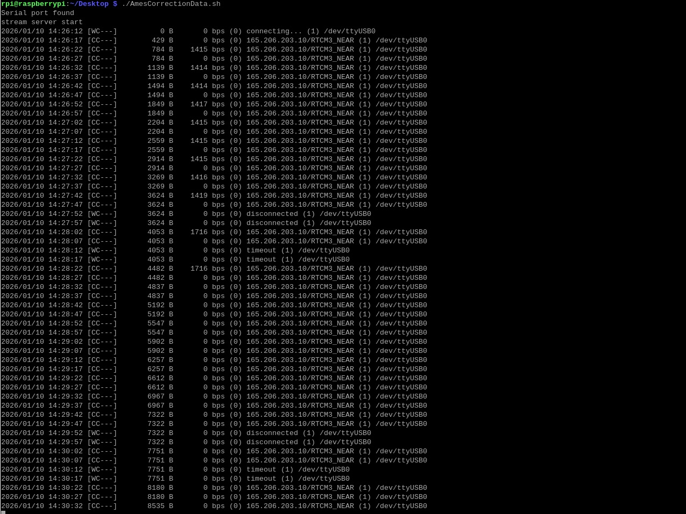
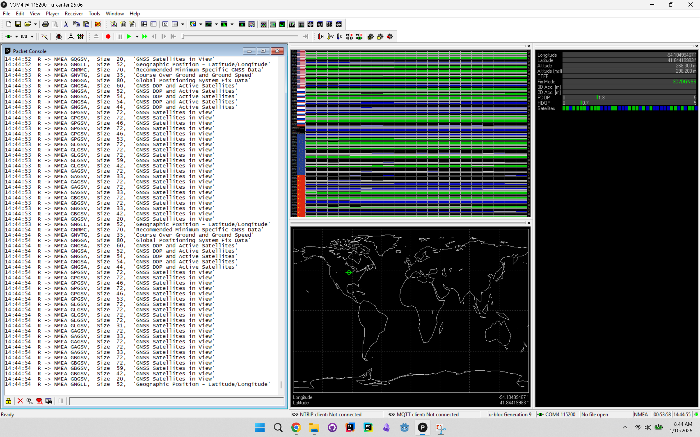

# Autonomous Snowplow - GPS
## About GPS

## At a glance:

This is actual footage from our gps running on Windows. On Linux we read the data from python.

This is sample output of longitude and latitude without RTK and default settings for U-Center.

- [Sample Output Text](../src/SampleUCenterLog.txt)

Example using RTK:

After running the script on the raspberry pi with Ames correction data I am able to achieve connection to the correction data and pipe via usb to the zed-f9p. This is passed from the correction data source via internet via to serial to uart that lands on the zed f9p. My current understanding, which could change, is that the desired output is: 

Stop generating: NMEA messages: GxGGA, GxGLL

Start generating: UBX-NAV-PVT. 

By right clicking the individual message types, I am able to disable messages and enable message types on the menu under View > Messages View. I believe this helps with validating the Real Time Kinematics and validating the accuracy however I could use help deciphering the landscape of NMEA messages. I am far from an expert with GPS. We tested this on 2 separate setups and both recieved a 3D lock only after the correction data script was started. The first one is showing in U-center: 3D/DGNSS and the second one is 3D/DGNSS/Float. It appears there are several other outcomes that can happen as well and would like to pinpoint the most desirable to reflect the mm precision detailed in the manual. The data sheet is located below with the other documentation. A forum indicated that float can indicate a noisy signal, I am unsure if this is accurate. I currently have the version that has "3D/DGNSS" and the lights on the zed f9p are: red=solid, green=solid, blue=solid, orange=flashing. The script is running and appears to be sending packets to the usb/uart connection ok with only a brief interuption occasionally and then resumes. I am unclear on the desirable outcome. My goal is to confirm reciept of packets by the zed f9p and produce the most accurate real time kinematic output on the usb leaving the zed via serial.

An example of reading from serial in python looks like this:

- [gps.py](../src/gps.py)
- [GPS Output](../src/gps.txt)

Snowplow's implementation is a little more complex. There are several methods of configuration for the Real Time Kinematic setup. One Zed-f9p is located on the snow plow. Real time kinematics involves an additional stationary gps base station that feeds correction data. This improves the accuracy to a point it is useable for competition. The normal method seen above recieves longitude and latitude but without thumbnail precision. In adding a second data source we are able to triangulate and further improve the accuracy. This is the reason the Raspberry PI is present currently. 

## Real Time Kinematic Data

Currently the Raspberry PI runs a python script that collects RTK data from a second source and pipes that back over usb to zed gps. The scripts are located in a gps folder in this repository. There are several options for this however the current implementation is this.
The Only Device that requires Wifi is the RPI.

Wifi is currently set to: Network: iBrick (2), Password: password. This can be changed to match the hotspot the team uses.
.
- [Ames, Iowa](../rpi/AmesCorrectionData.sh)
- [St Paul, Minnesota](../rpi/StPaulCorrectionData.sh)

The RPI must be connected to a mobile hotspot on someones phone in order to be able to retrieve the correction data. Additionally one script needs to be run from the desktop. One is for Iowa and one is for Minnesota (competition location). Both scripts access publicly available gps data. Just connect to wifi and run the script. The bluetooth method has been tested but requires an app instead of a wifi hotspot.

For Registering Credentials:

[Minnesota](https://mncors.dot.state.mn.us/RegisterAccount.aspx)

Ames,IA script does not require credentials.

## The GPS used for this project is:

- [Product Specs](https://www.sparkfun.com/sparkfun-gps-rtk-sma-kit.html)

- [GPS Hookup Guide](https://learn.sparkfun.com/tutorials/gps-rtk2-hookup-guide)

- [Connect to a Correction Source](https://learn.sparkfun.com/tutorials/gps-rtk2-hookup-guide/connecting-the-zed-f9p-to-a-correction-source)

- [Setting up RTK2GO](http://rtk2go.com/how-to-connect/)

- [GPS info](http://monitor.use-snip.com/?hostUrl=rtk2go.com&port=2101)

- [Datasheet](./ZED-F9P-02B_DataSheet_UBX-21023276.pdf)

- [NMEA Sentence Structures](./NMEA_Format_v0.1.pdf)

## Our implementation and scripts that reference the GPS:

- [Schematic](./SparkFun-GPS-RTK-SMA-ZED-F9P-Schematic.pdf)

- [RobotGPS.py](../src/RobotGPS.py)

- [GPS_Node.py](../src/GPS_Node.py)

