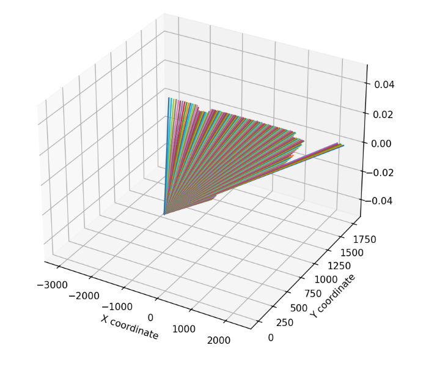
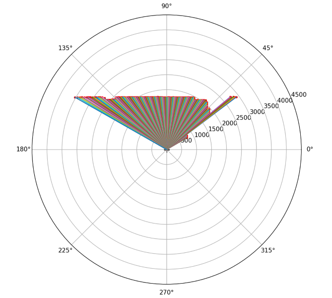
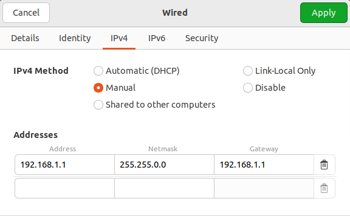
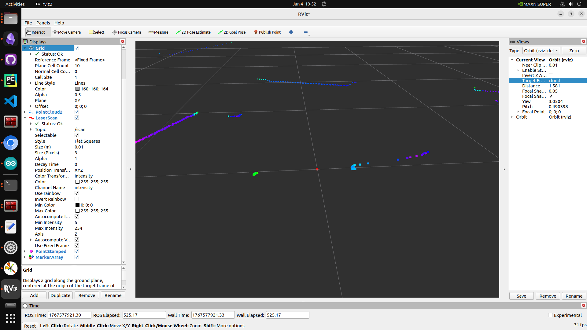
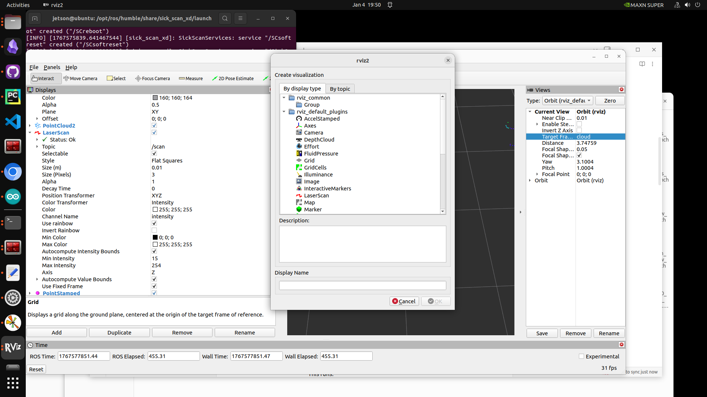
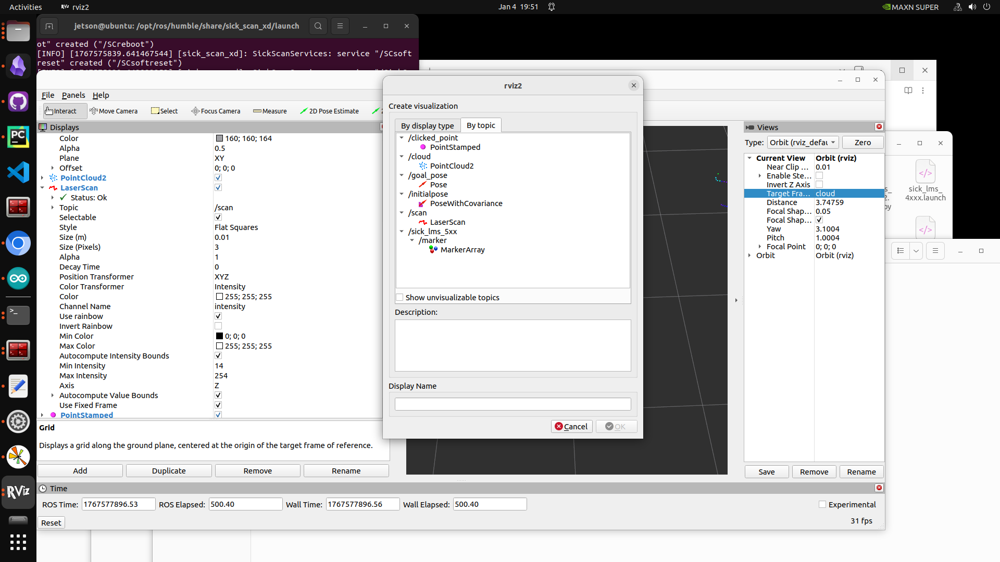

## Autonomous Snowplow - Lidar
## About Lidar

The lidar used for this project is:
- [Product Specs](https://www.sick.com/ag/en/products/lidar-and-radar-sensors/lidar-sensors/lms5xx/lms511-10100-pro/p/p215941)
- [ROS Driver](https://github.com/SICKAG/sick_scan_xd)
- [Lidar.py](../src/Lidar.py)
- [Lidar Installation](https://docs.ros.org/en/humble/p/sick_scan_xd/)

To help visualize what is happening:


* Cartesian:



* Polar Coordinates:




Before the lidar will function, IP configuration must be complete or the Lidar will not be able to recieve packets. The current implementation 
involves using the sick_scan_xd packages that "publish" data over a ROS2 topic. (This is different from the script that is being used to generate the above images; 
It is in here to show how to parse a packet if the team decides to stray from ROS2.) This data is retrieved from the topic and used to map the snowplow to a grid. 
More or less we scan, then generate a map on an x,y and ultimately use Dijkstra's for path planning.

To ensure proper configuration, double check the following items and run the command:


```
nc -z -v -w5 192.168.1.2 2112
```


If the IP address is improperly configured, it will fail with the message Network is unreachable. No progress can be made until the connection can be established.

## Installation is: 

```
sudo apt update
sudo apt-get install ros-humble-sick-scan-xd
```

Quick Start Guide:
## 1. IP Configuration Must Be Completed First:
Set IP for Lidar through Sopas on Windows to 192.168.1.2

## 2.Set IP for Jetson nano and disable WiFi. On Jetson, terminal command: 

```
ifconfig 
```

## Produces the following output:


```
enP8p1s0:Realtek Semiconductor Co.\, Ltd. RTL8111/8168/8411 PCI Express Gigabit Ethernet Controller

wlP1p1s0:Realtek Semiconductor Co.\, Ltd. RTL8822CE 802.11ac PCIe Wireless Network Adapter
```

## Look through devices for ID of Ethernet
```
enP8p1s0
ifconfig enP8p1s0
nmcli con add con-name "static-enP8p1s0" ifname enP8p1s0 type ethernet ip4 192.168.1.1/16 gw4 192.168.1.1
nmcli con up "static-enP8p1s0"
```



## Before running Any command in ROS2 you must source the environment. If the environment is not sourced. You can source it on humble by running:

```
source /opt/ros/humble/setup.bash
```

## The file locations may be different on the snowplow. this command can be updated but feel free to use as a template.

```
# Change Directory to launch folder
cd /opt/ros/humble/share/sick_scan_xd/launch

ros2 run sick_scan_xd sick_generic_caller sick_lms_5xx.launch
hostname:=192.168.1.2
```

Previous Command that needs to be updated

```
python3 src/IMU_Node.py & python3 test/test_mock_gps.py & ros2 run sick_scan_xd sick_generic_caller sick_scan_xd_test.launch
```

## Running In Operational Mode with Movement:

(Before running the main function, we need to start sick_scan_xd, Arduino_Node, and GPS_Node)
It will be something like this:
```
/home/jetson/Desktop/Sandbox/Snow-Plow-On-Jetson/src/Serial_Detect.py & python3 /home/jetson/Desktop/Sandbox/Snow-Plow-On-Jetson/src/Arduino_Node.py & python3 /home/jetson/Desktop/Sandbox/Snow-Plow-On-Jetson/src/Arduino_Node.py & ros2 run sick_scan_xd sick_generic_caller sick_scan_xd_test.launch

# Here is the previous command:

python3 src/IMU_Node.py & python3 test/test_mock_gps.py & ros2 run sick_scan_xd sick_generic_caller sick_scan_xd_test.launch
 ```


## Running the Main Function:

> [!WARNING]

> WARNING! THIS COMMAND STARTS THE MOTORS.


Start the robot with actual GPS, IMU and LIDAR attached and clear view of the sky:
(Use This Outside Only after familiarizing yourself with the main.py script)

This function will initialize the robot and lidar, create the object map with lidar data,
and begin motion of the robot:

```
python3 src/main.py

```


Runs RVIZ:
```
source /opt/ros/humble/setup.bash
ros2 run rviz2 rviz2
```




For LMS5xx-family:

Linux native: sick_generic_caller sick_lms_5xx.launch

Linux ROS 2: ros2 run sick_scan_xd sick_generic_caller ./src/sick_scan_xd/launch/sick_lms_5xx.launch

Continue to Operating Procedure
- [Operating Procedure](../docs/operating.MD)

